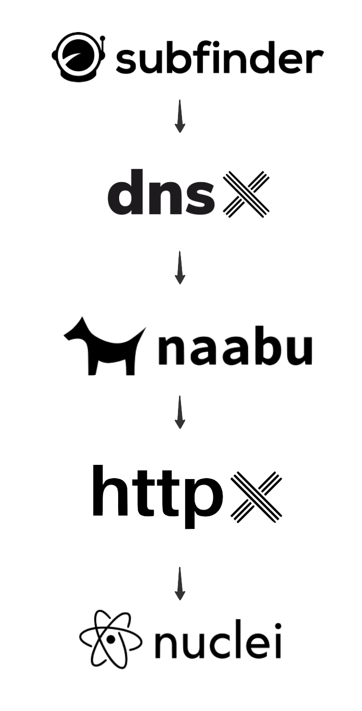

# Compose Workflow for Bug Bounty

This repo aims to be used as a baseline for automating some tedious jobs related to BB automation for when you want to have a quick sneak of your targets.

## Arquitecture
By default I've added the following tools and uploaded a set of configfiles that can be used for this purpose, but this idea can be extended for other use cases.
<p align="center">
  
</p>

## Dependencies
By default the only dependency is to have docker installed in your computer. There's a case when trying to run this from a Mac with Apple silicon chip where you might need to adapt the compose workflow. Please uncomment those lines to have it working there.

## Use Cases

### Nuclei Templates
There's a folder under config called custom-nuclei-templates, that folder is going to be mounted inside the nuclei templates folder at runtime so those are going to be available such as the common ones. There's a github action that updates Nuclei Templates from it's base repo once a day.

### Sorting Tools
That's barely a copy of golang base image with some tools that I've used to parse the information and present it from one step to the other correctly.

### How to use it

Once you have downloaded the repo, consider checking the configfiles before running any workflow.

If you want to trigger only one particular step please run a command like:

```bash
docker compose run --no-deps --rm --quiet-pull nuclei
```
Where we specify compose only to run that particular step without deps and to remove the container when it finishes. Please consider in each of the cases having the input files setted up correctly

On another hand if you want to run the whole workflow as described in the image above, run the following command
```bash
docker compose up --remove-orphans
```
This would run the whole workflow and cleanup the resultant containers when they are done. Please also consider filling up in this case the **subfinder-input** file with the domains you want to scan